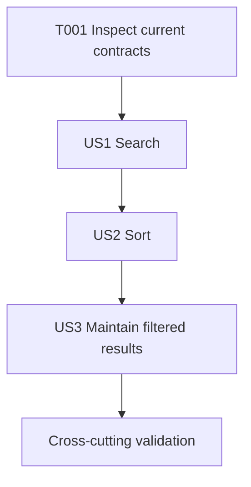

# Tasks: Admin Search and Sort

**Input**: Design documents from `/specs/002-admin-search-sort/`

**Prerequisites**: [plan.md](./plan.md), [spec.md](./spec.md), [research.md](./research.md), [data-model.md](./data-model.md), [admin-list-contract.md](./contracts/admin-list-contract.md), and [quickstart.md](./quickstart.md)

**Tests**: Focused UI interaction coverage is required by the plan and constitution quality gate.

**Organisation**: Tasks are grouped by user story so each can be completed and tested independently.

## Phase 1: Setup (Shared Infrastructure)

**Purpose**: Confirm the current admin list boundary and existing test command before changing feature code.

- [X] T001 Inspect `src/components/admin/AdminGameList.tsx` and `tests/e2e/admin-games.spec.tsx` to confirm the current list markup, action labels, and test conventions.

## Phase 2: Foundational (Blocking Prerequisites)

**Purpose**: No new data model, service, route, storage, or dependency is required. Complete T001 before the story tasks to preserve the current component contract.

## Phase 3: User Story 1 - Find an Admin Game Record (Priority: P1) MVP

**Goal**: An authorised admin can use a case-insensitive, trimmed search to locate game records, including descriptive text, with a clear no-match state.

**Independent Test**: Enter full or partial titles, identifying descriptive text, and a no-match query in the admin list. Verify matching rows retain edit and publication-status actions, and the no-match query remains editable.

- [X] T002 [US1] Add interaction coverage in `tests/e2e/admin-games.spec.tsx` for trimmed, case-insensitive title and descriptive-text search; assert matching rows retain their edit and status actions and no-match feedback keeps the query visible.
- [X] T003 [US1] Implement local search-query state and a non-mutating derived matching list in `src/components/admin/AdminGameList.tsx`, searching title, summary, aim, instructions, activity type, suitability notes, and keywords with trimmed case-insensitive substring matching.
- [X] T004 [US1] Add labelled, keyboard-operable search UI and distinct empty-catalogue/no-match states in `src/components/admin/AdminGameList.tsx`, retaining existing fallback title and summary labels for incomplete records.
- [X] T005 [US1] Run `npm run test:e2e -- tests/e2e/admin-games.spec.tsx` and repair `src/components/admin/AdminGameList.tsx` or `tests/e2e/admin-games.spec.tsx` only if this focused scenario fails.

## Phase 4: User Story 2 - Order Admin Game Records (Priority: P1)

**Goal**: An authorised admin can order the current search results by title, publication status, or most recently updated, with deterministic ties.

**Independent Test**: Select each sort option with and without an active search, verify the correct order, and confirm the active query is retained.

- [X] T006 [US2] Extend `tests/e2e/admin-games.spec.tsx` with coverage for title, publication-status, and newest-updated sorting, including predictable tied values and preservation of an active search query.
- [X] T007 [US2] Add local sort-preference state and non-mutating deterministic comparators in `src/components/admin/AdminGameList.tsx`: `title-asc` sorts by UK-English title then id, `status-asc` sorts by documented status then title then id, and `updated-desc` sorts newest first then title then id.
- [X] T008 [US2] Add a labelled native sort selector to `src/components/admin/AdminGameList.tsx` that reorders only the currently matched results and remains usable at narrow widths via existing toolbar styles.
- [X] T009 [US2] Run `npm run test:e2e -- tests/e2e/admin-games.spec.tsx` and repair `src/components/admin/AdminGameList.tsx` or `tests/e2e/admin-games.spec.tsx` only if this focused scenario fails.

## Phase 5: User Story 3 - Maintain Records from a Filtered List (Priority: P2)

**Goal**: Search and sort remain coherent after an admin uses an existing edit, publish, or retire action.

**Independent Test**: Apply a query and a sort order, invoke a displayed record's publication-status action, and verify the correct record changes while the active view remains understandable.

- [X] T010 [US3] Extend `tests/e2e/admin-games.spec.tsx` to assert status-action callbacks receive the displayed record id while a search and sort are active, and to cover the distinct zero-record state.
- [X] T011 [US3] Preserve the existing per-record edit, publish, and retire actions in the derived result rendering in `src/components/admin/AdminGameList.tsx`, ensuring changed statuses are reflected by the active sorted result view.
- [X] T012 [US3] Run `npm run test:e2e -- tests/e2e/admin-games.spec.tsx` and repair `src/components/admin/AdminGameList.tsx` or `tests/e2e/admin-games.spec.tsx` only if this focused scenario fails.

## Phase 6: Polish and Cross-Cutting Validation

**Purpose**: Confirm no regression to admin maintenance, other application workflows, or production compilation.

- [X] T013 Run `npm test` to validate unit, integration, and contract coverage after changes to `src/components/admin/AdminGameList.tsx`.
- [X] T014 Run `npm run test:e2e` to validate all interaction workflows after changes to `src/components/admin/AdminGameList.tsx` and `tests/e2e/admin-games.spec.tsx`.
- [X] T015 Run `npm run build` to validate the production application after changes to `src/components/admin/AdminGameList.tsx`.
- [X] T016 Perform the keyboard-only and 720px-or-narrow manual checks from `specs/002-admin-search-sort/quickstart.md` against `/admin/games`.

## Dependencies and Execution Order

- T001 precedes all implementation tasks because it confirms the current list and test contract.
- User Story 1 is the MVP and must complete before the sorting and maintenance follow-ups.
- User Story 2 depends on the derived search list from User Story 1.
- User Story 3 depends on the search and sort rendering from User Stories 1 and 2.
- T013-T016 run after all story tasks are complete.

## Parallel Opportunities

- Within each story, its focused test task can be prepared independently from implementation after T001, but it must be completed before the corresponding implementation validation task.
- T013, T014, and T015 are independent commands after T012 and may run in parallel when the environment allows it.

## Implementation Strategy

1. Complete T001-T005 to deliver and validate the independently useful search MVP.
2. Complete T006-T009 to add deterministic ordering while preserving the search view.
3. Complete T010-T012 to prove maintenance actions work from the derived view.
4. Complete T013-T016 before release.